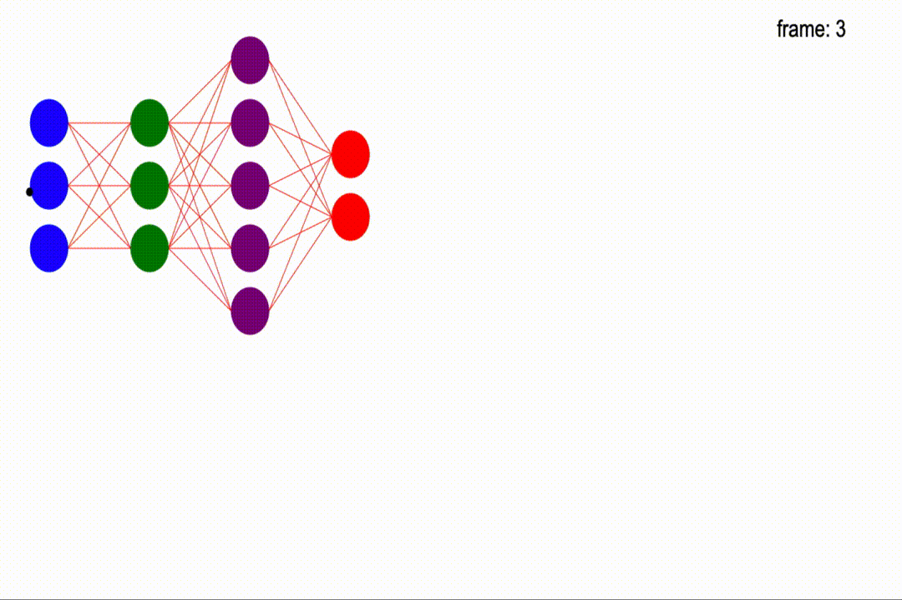

# Neuradraw-2

A simple drawing paradigm with guided asset creation for mathematical animations and images.

## Summary

Neuradraw came from the desire to be able to draw complex neural network architectures with a variety of different colors and annotations. The project's conception is based in the `neuradraw` repository but continues on these different flavors and versions. Those flavors and versions are:

[`Neuradraw-ts`](https://github.com/Bryce-Davidson/neuradraw-ts) & the original [`Neuradraw`](https://github.com/Bryce-Davidson/neuradraw)

The reasons for moving on to developing on a different code base and paradigm are included below in the discontinued section.

# Discontinued Reasons

Decided that drawing on the canvas did not include many of the features in the project’s intended goals and features. While fast, the canvas object does not include an easy interface for morphing and interpolating canvas path’s as well as the lack of canvas documentation and packages to aid with the development. 

The next version of neuradraw will be written in [typescript](https://www.typescriptlang.org/) and [W3-SVG](https://www.w3.org/TR/SVG2/) to take advantage of the comprehensive libraries, documentation and support for SVG with the added benefit of typescript typing.


# Table of Contents

- [Neuradraw-2](#neuradraw-2)
  - [Summary](#summary)
- [Discontinued Reasons](#discontinued-reasons)
- [Table of Contents](#table-of-contents)
- [Overview](#overview)
- [Installation](#installation)
- [Drawing Example](#drawing-example)
- [Guided Asset Creation](#guided-asset-creation)
  - [Draw Lifecycle Methods](#draw-lifecycle-methods)
  - [Primitive Shapes](#primitive-shapes)
- [Asset Controllers](#asset-controllers)
  - [Asset Controller](#asset-controller)
  - [Animation Controller](#animation-controller)
  - [Scene](#scene)
  - [Timeline](#timeline)
- [Asset Animation](#asset-animation)

# Overview

Neuradraw-2 is a developer facing drawing paradigm with a customizable API and guided asset creation.


Neuradraw-2 focuses on giving developers the ability to design and define their own assets and extend one of the AssetControllers to give thier assets easy to use animation controls.

Through the asset creation process the developper will define simple functions included within thier asset class such as:


```javascript
compute();
draw();
_draw_function();
__compute_function();
```
Examples can be seen below.

# Installation

To install `Neuradraw-2` run the command:

`git clone https://github.com/Bryce-Davidson/neuradraw-2`

And then run `npm install`

# Drawing Example

<details>
  <summary>Inside <code>index.js</code></summary>
  
  ```javascript
    import { ctx } from './Meta/canvas';
    import Scene from './Controllers/Scene';

    import DNN from './Assets/Custom/Controlled/DNNControlled';
    import { easeCubicInOut } from 'd3-ease';
    import CircelControlled from './Assets/Custom/Controlled/CircleControlled';

    var s1 = new Scene(ctx, "s1", {
        duration:2000, 
        show_frame_count: true,
        fps: 60,
        show_time: false
    })

    var d1 = new DNN("d1", 1, s1.num_frames, {
        x: 50,
        y: 0,
        diameter: 60,
        layer_spacing: 100,
        node_spacing: 20,
        weight_colors: 'red',
        weight_thicknesses: 1.1
    })

    d1.add_layer(3, "blue", "input", {})
    d1.add_layer(3, "green", "h_1", {})
    d1.add_layer(5, "purple", "h_2", {})
    d1.add_layer(2, "red", "output", {})

    var c1 = new CircelControlled("c1", 1, s1.num_frames, {
        x: 100,
        y: 100,
        radius: 45
    })


    d1.config_from_to(d1.default, {
        x: 800,
        y: -120,
        node_spacing: 100,
        weight_colors: 'blue'
    }, {
        easing: easeCubicInOut,
        start_frame: 1,
        end_frame: Math.floor(d1.frame_out/2)
    })

    d1.value_from_to({
        config_key: "x",
        from: 800,
        to: 40,
        easing: easeCubicInOut,
        start_frame: Math.floor(d1.frame_out/2),
        end_frame: d1.frame_out
    })

    c1.config_map(d1, {
        x: "x", 
        radius: {
            other_key: "x",
            controller: x => x/10
        },
        y: {
            other_key: "x",
            controller: x => 200 + 100 * Math.sin(x/100)
        }
    }, {
        start_frame: d1.frame_in,
        end_frame: Math.floor(d1.frame_out/2)
    })

    c1.value_from_to({
        config_key: "radius",
        from: c1.get_frame(Math.floor(d1.frame_out/2)).radius,
        to: 150,
        easing: easeCubicInOut,
        start_frame: Math.floor(d1.frame_out/2),
        end_frame: d1.frame_out
    })

    s1.add_assets(d1, c1)
    s1.play();

  ```
</details>



# Guided Asset Creation
## Draw Lifecycle Methods
## Primitive Shapes
# Asset Controllers
## Asset Controller
## Animation Controller
## Scene
## Timeline
# Asset Animation
